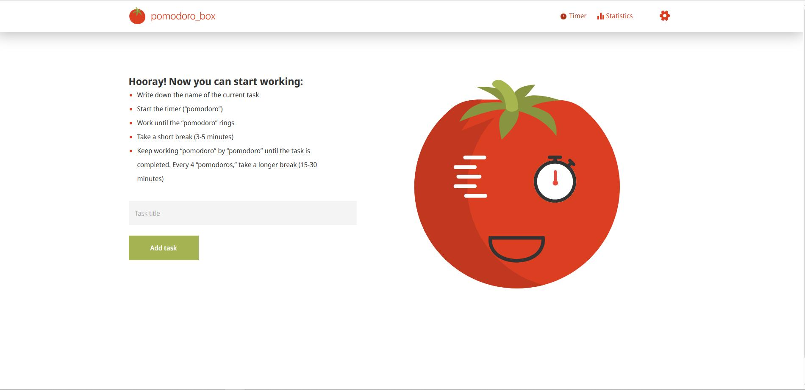
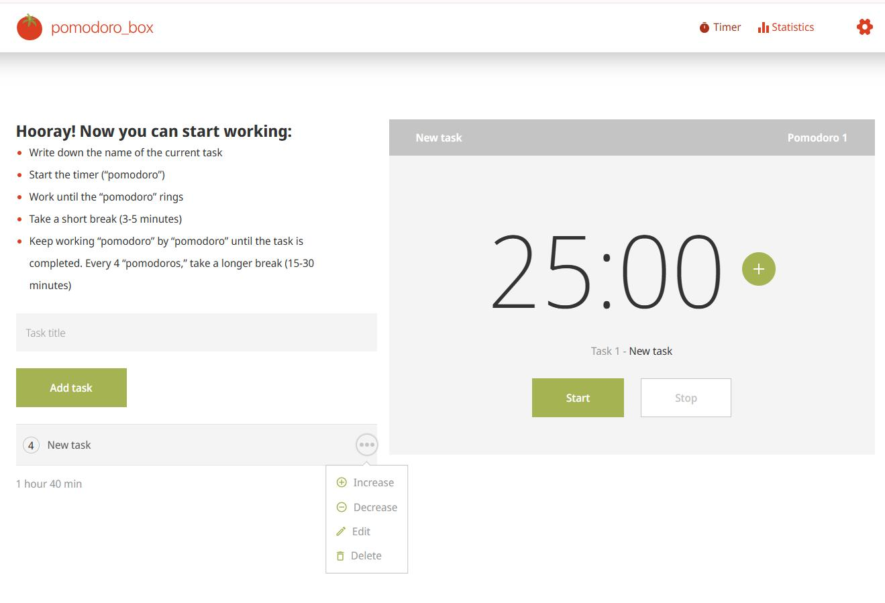
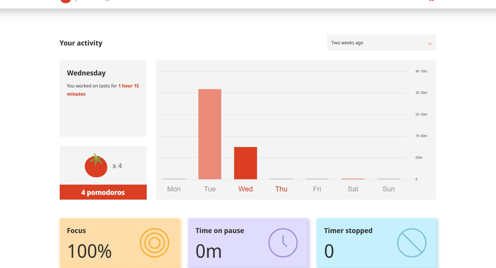
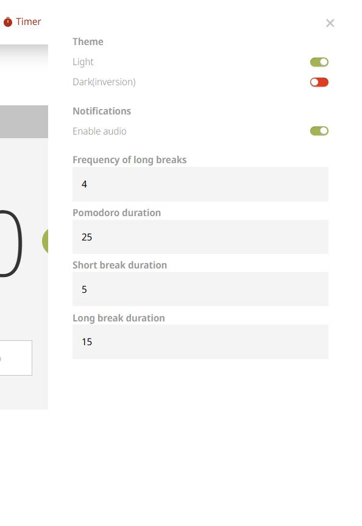

# 🍅 Pomodoro Box

> A modern, feature-rich task tracking application built with the Pomodoro Technique to boost your productivity and time management skills.

---

## 📋 Table of Contents

- [Overview](#overview)
- [Features](#features)
- [Screenshots](#screenshots)
- [Tech Stack](#tech-stack)
- [Installation](#installation)
- [Getting Started](#getting-started)
- [Usage Guide](#usage-guide)
- [Project Structure](#project-structure)
- [Contributing](#contributing)

---

## 🎯 Overview

**Pomodoro Box** is a web-based productivity application designed to help you manage your time effectively using the renowned Pomodoro Technique. The app combines task tracking, time management, and detailed statistics to provide you with comprehensive insights into your work patterns and productivity metrics.

Perfect for students, developers, and professionals who want to:
- Boost focus and concentration
- Track completed tasks systematically
- Analyze productivity trends
- Manage work-life balance
- Improve time estimation skills

---

## ✨ Features

### Core Functionality
- **⏱️ Interactive Timer**: Customizable Pomodoro sessions with visual feedback
- **📋 Task Management**: Create, organize, and track your tasks
- **📊 Detailed Statistics**: Visualize your productivity with interactive charts
- **⚙️ Smart Settings**: Customize session durations and app preferences
- **💾 Local Data Storage**: All your tasks and metrics are automatically saved in your browser's local storage

### Advanced Capabilities
- **Real-time Metrics**: Track completed pomodoros, focus time, and task breakdown
- **Time Analytics**: Visual representations of your working patterns
- **Responsive Design**: Seamless experience on desktop and mobile devices
- **Dark/Light Theme Support**: Eye-friendly interface options

---

## 📸 Screenshots

### Main Timer Interface

*The central hub where you manage your active tasks and pomodoro sessions*

### Task Management

*Easily add, edit, and organize your tasks*

### Statistics & Analytics

*Track your productivity metrics and visualize your work patterns*

### Settings Panel

*Customize your pomodoro sessions and app preferences*

---

## 🛠️ Tech Stack

### Frontend Framework
- **React 18+** - UI library for building interactive interfaces
- **TypeScript** - Static typing for enhanced code quality and maintainability
- **Vite** - Next-generation build tool for optimized development experience

### Styling & UI
- **SCSS/SASS** - Advanced styling with variables, mixins, and nesting
- **Responsive Design** - Mobile-first approach for all screen sizes

### State Management & Hooks
- **React Context API** - Global state management for tasks, settings, and metrics
- **Custom Hooks** - Reusable logic for timers, validation, and data management
- **Web Workers** - Background processing for accurate timing

### Testing & Quality
- **Jest** - Unit testing framework
- **Type Safety** - Full TypeScript coverage for reliability

### Build & Deployment
- **Vite** - Fast build and HMR (Hot Module Replacement)
- **Netlify** - Optimized deployment with redirect rules

---

## 💿 Installation

### Prerequisites
- Node.js (v16.0.0 or higher)
- npm or yarn package manager

### Setup Steps

1. **Clone the repository**
   ```bash
   git clone https://github.com/Nelenik/pomodoro_box.git
   cd pomodoro_box
   ```

2. **Install dependencies**
   ```bash
   npm install
   # or
   yarn install
   ```

3. **Start the development server**
   ```bash
   npm run dev
   # or
   yarn dev
   ```

4. **Open in browser**
   ```
   http://localhost:5173
   ```

### Build for Production
```bash
npm run build
# or
yarn build
```

---

## 🚀 Getting Started

### First Time Setup

1. **Launch the application** and you'll be greeted with the Timer page
2. **Create your first task** using the task form
3. **Configure settings** (optional) - set your preferred session duration
4. **Start the timer** and begin your first pomodoro session
5. **Check statistics** after completing tasks to track your progress

### Quick Tips
- A standard pomodoro session is 25 minutes of focused work
- Follow each session with a 5-minute break
- After 4 pomodoros, take a longer 15-30 minute break
- Use the statistics page to identify your productivity patterns

---

## 📖 Usage Guide

### Managing Tasks
- **Add Task**: Fill the task form and press Enter or click Add
- **Edit Task**: Click on an existing task to modify its details
- **Delete Task**: Use the confirm dialog to remove tasks
- **Task Status**: Track which tasks are completed, in-progress, or pending

### Timer Controls
- **Start/Pause**: Control your pomodoro session
- **Reset**: Stop current session and reset the timer
- **Skip**: Move to the next session (short or long break)

### Tracking Progress
- **View Statistics**: Navigate to the Statistics page to see:
  - Total pomodoros completed
  - Time focused vs. time on breaks
  - Task completion breakdown
  - Weekly productivity trends
  - Visual charts and graphs

### Customizing Settings
- **Session Duration**: Set custom pomodoro length (default: 25 min)
- **Break Duration**: Configure short and long break times
- **Notifications**: Enable/disable session completion alerts
- **Theme**: Choose preferred color scheme

---

## 📁 Project Structure

```
pomodoro_box/
├── src/
│   ├── components/          # Reusable React components
│   │   ├── Timer/          # Main timer component
│   │   ├── TasksList/      # Task list display
│   │   ├── TaskForm/       # Task input form
│   │   ├── Settings/       # Settings management
│   │   ├── Modal/          # Modal dialogs
│   │   ├── Dropdown/       # Dropdown menus
│   │   └── MetrikBlock/    # Metrics display
│   ├── pages/              # Page-level components
│   │   ├── TimerPage/      # Main timer interface
│   │   └── Statistics/     # Analytics dashboard
│   ├── hooks/              # Custom React hooks
│   │   ├── useInterval/    # Interval management
│   │   ├── useFormValidation/ # Form validation logic
│   │   ├── useChart/       # Chart utilities
│   │   └── useTimerTick/   # Timer tick logic
│   ├── reducers_providers/ # State management
│   │   ├── TasksListProvider/ # Tasks context
│   │   ├── SettingsProvider/  # Settings context
│   │   └── ActiveTaskProvider/ # Active task context
│   ├── types/              # TypeScript type definitions
│   ├── utils/              # Utility functions
│   ├── styles/             # Global styles
│   └── main.tsx            # Application entry point
├── public/                 # Static assets
├── vite.config.ts         # Vite configuration
├── tsconfig.json          # TypeScript configuration
├── jest.config.ts         # Jest testing configuration
└── package.json           # Project dependencies
```

---

## 📝 License

This project is open source and available under the MIT License.

---

## 🎉 Acknowledgments

Built with ❤️ using React, TypeScript, and the Pomodoro Technique principle.

**Happy coding and stay productive!** 🚀